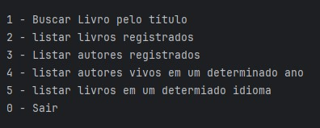
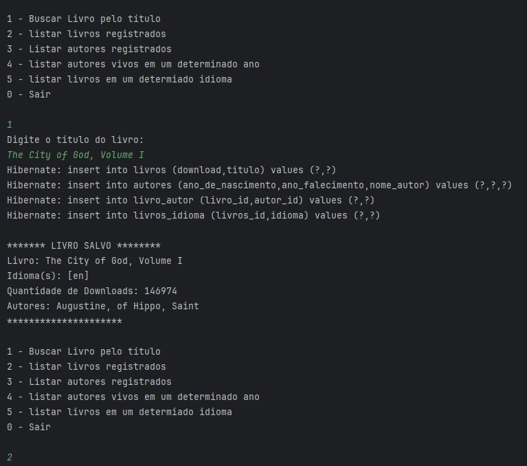
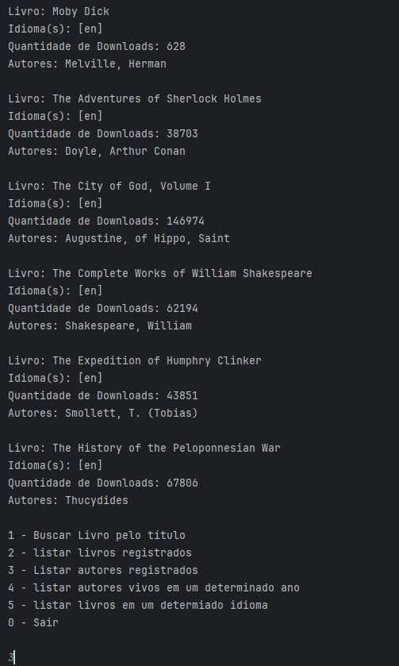
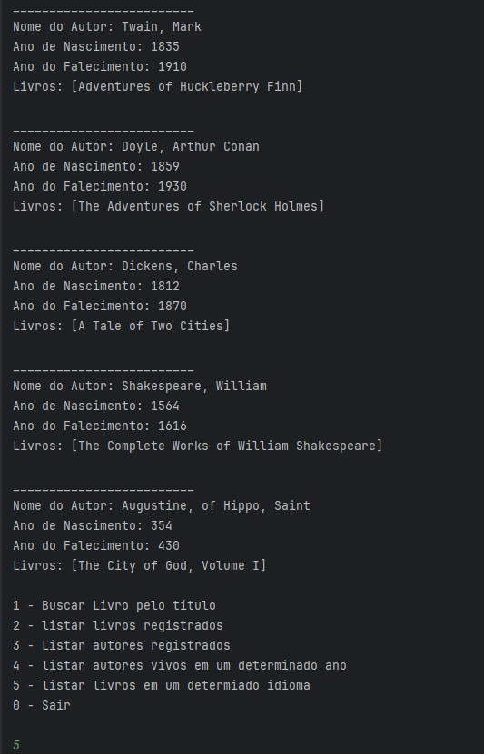
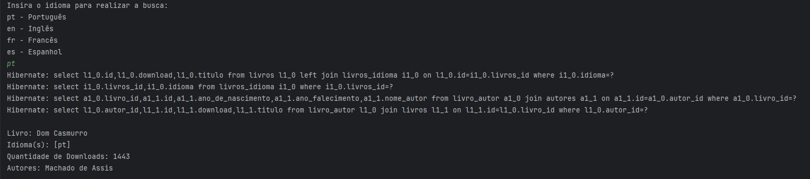

# 📚 Espaço Literatura


[](https://gutendex.com/)


O **Espaço Literatura** é uma plicação Java desenvolvida com Spring Boot, baseada em console que permite buscar informações de livros através de uma API externa e armazená-las em um banco de dados.

Os dados consumidos são mapeados através de **records** e convertidos para entidades da aplicação antes de serem persistidos.

## Tecnologias utilizadas

- Java
- Spring Boot
- Spring Data JPA
- Hibernate
- H2 Database
- PostgreSQL
- Maven

---

## Arquitetura

O projeto segue uma organização simples em camadas:

- **model** → entidades e records utilizados na aplicação  
- **repository** → acesso ao banco de dados  
- **service** → consumo da API e processamento dos dados  
- **principal** → interface via terminal (menu interativo)  
- **application** → inicialização com Spring Boot  

---

## Funcionalidades

A aplicação oferece as seguintes opções via terminal:

- Buscar livro pelo título
- Listar livros registrados  
- Listar autores registrados 
- Listar autores vivos em um determinado ano
- Listar livros em um determinado idioma (pt, )

Ao buscar um livro pelo título, a aplicação retorna informações como nome da obra, idioma, quantidade de downloads e autores relacionados.

Já na listagem de autores cadastrados, são exibidos dados como nome, ano de nascimento, ano de falecimento e os livros associados a cada autor.

## Banco de dados

A aplicação suporta:

- H2 (memória ou arquivo)  
- PostgreSQL  

> A configuração do banco pode ser adaptada conforme necessário.

### Configuração do banco de dados

As configurações e instruções detalhadas sobre utilização do:

- H2 em memória
- H2 em arquivo
- PostgreSQL
- variáveis de ambiente

já estão documentadas em outro projeto.

- [Acesse aqui o guia completo](https://github.com/Kathlynleticia/listensoul)

---

## Fluxo da aplicação

1. O usuário escolhe uma opção no menu  
2. A aplicação consome a API de livros  
3. Os dados são convertidos (records → entidades)  
4. As informações são persistidas no banco de dados  
5. Os dados podem ser consultados posteriormente  

---
## Pré-requisitos

Antes de executar o projeto, certifique-se de ter instalado:

- Java 17
- Maven

---

## Executando o projeto

1. Clone o repositório:

```bash
git clone https://github.com/Kathlynleticia/espaco-literatura
```
2. Abra o projeto em sua IDE
Recomendado: IntelliJ IDEA

3. Execute a classe principal
Rode a classe Main para iniciar o programa.

--- 
## Demonstração - Execução do Sistema
<br>

<br>
<br>
<br>
<br>
<br>
<br>
<br>
<br>
<br>

---

## Observações

- A aplicação é executada via terminal  
- Utiliza consumo de API externa  
- Os dados são persistidos para consultas futuras  
- Segue uma arquitetura em camadas simples  

---

## Possíveis melhorias

- Implementar API REST  
- Adicionar mais filtros de busca  
- Melhorar tratamento de erros da API  
- Criar interface gráfica  

---
## 🙋🏻 Autora

Kathlyn Santos
